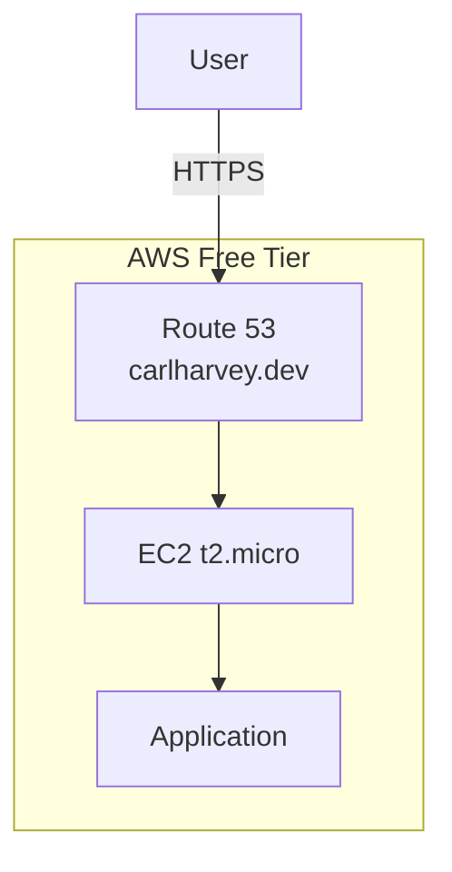
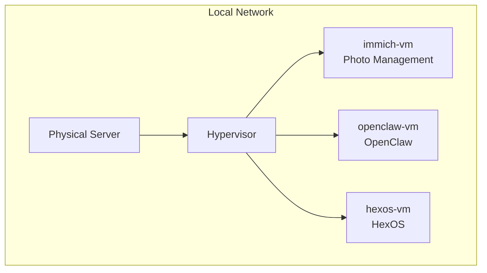

# Architecture Diagrams

## DevOps Project — AWS

```mermaid
graph TB
    User-->|HTTPS|R53[Route 53\ncarlharvey.dev]
    R53-->EC2[EC2 t2.micro]
    EC2-->App[Application]

    subgraph AWS Free Tier
        R53
        EC2
        App
    end
```

## Home Server — VM Layout

```mermaid
graph TB
    HW[Physical Server]-->HV[Hypervisor]
    HV-->VM1[immich-vm\nPhoto Management]
    HV-->VM2[openclaw-vm\nOpenClaw]
    HV-->VM3[hexos-vm\nHexOS]

    subgraph Local Network
        HW
        HV
        VM1
        VM2
        VM3
    end
```
