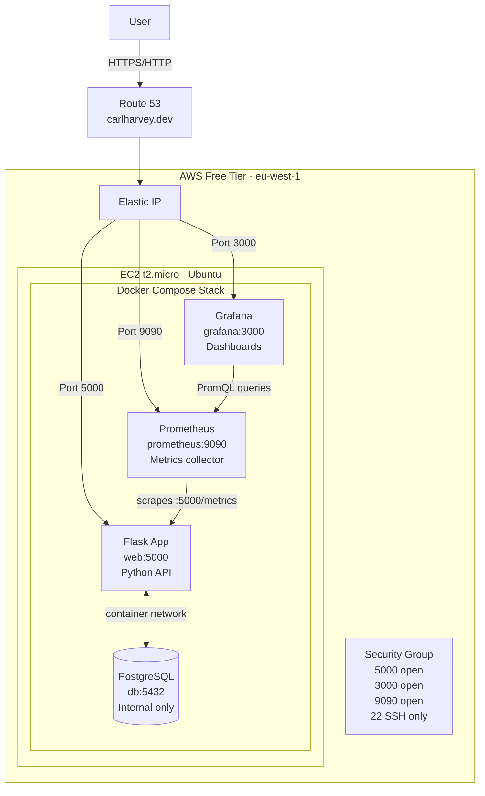
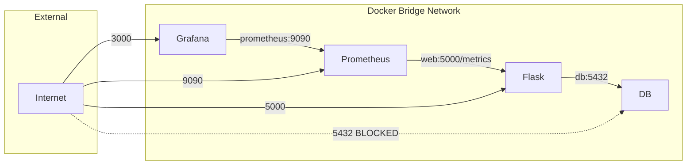
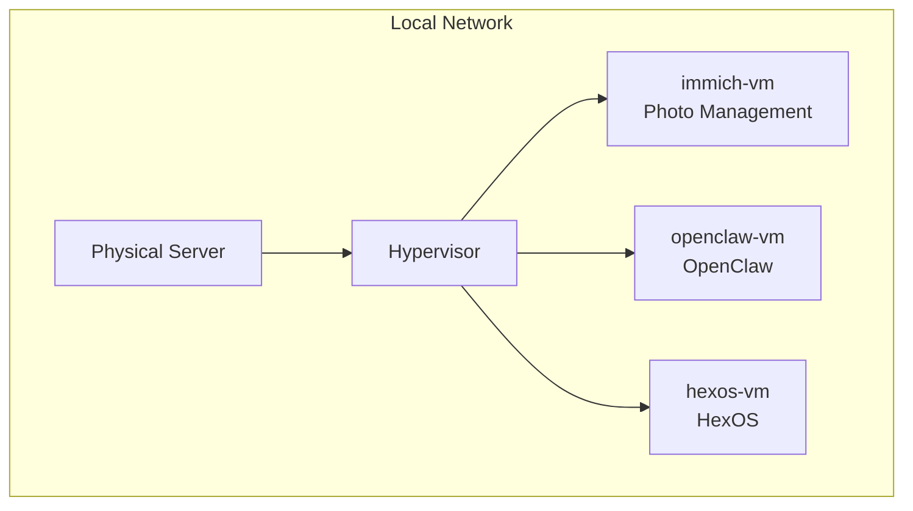
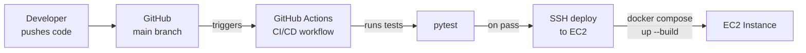

# Architecture Diagrams

## DevOps Project — AWS Stack

Full architecture showing AWS infrastructure and Docker Compose internals.

---

## Docker Network — How Containers Communicate

Containers talk to each other using service names as hostnames. This is why Flask connects to `db:5432` not `localhost:5432`.

---

## Home Server — VM Layout

---

## Future State — CI/CD Pipeline

Planned addition once GitHub Actions is configured.

