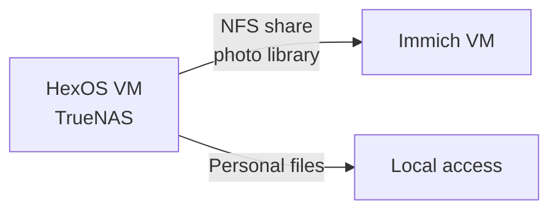

# Home Server Infrastructure

**Hypervisor:** Proxmox  
**Location:** On-premises / local network

---

## Hardware

| Spec | Value |
|---|---|
| CPU | — |
| RAM | — |
| Storage | — |
| Proxmox Version | — |

> Fill in hardware specs — useful for capacity planning and support

---

## Network

| Detail | Value |
|---|---|
| Proxmox UI | https://PROXMOX_IP:8006 |
| Local subnet | 192.168.x.0/24 |
| Remote access | — (Tailscale planned) |

---

## VM Summary

| VM | Purpose | Network | RAM | Disk | Status |
|---|---|---|---|---|---|
| HexOS | TrueNAS storage + NFS | Local | — | — | 🟢 Running |
| Immich | Photo management | Local | — | — | 🟢 Running |
| OpenClaw | Bot — isolated | SSH only | — | — | 🟢 Running |
| Debian | Dev / testing | Local | — | — | 🟡 On demand |
| ... | ... | ... | ... | ... | ... |

> 44 VMs total — add others as needed

---

## Storage Architecture

HexOS is the single source of truth for persistent data. All other VMs that need storage consume it via NFS or direct access.

---

## Proxmox Backup Schedule

| VM | Backup frequency | Retention | Storage target |
|---|---|---|---|
| HexOS | — | — | — |
| Immich | — | — | — |
| OpenClaw | — | — | — |
| Debian | On demand | 1 snapshot | Local |

> Set up Proxmox Backup Server or configure backup jobs in Proxmox UI → Datacenter → Backup
