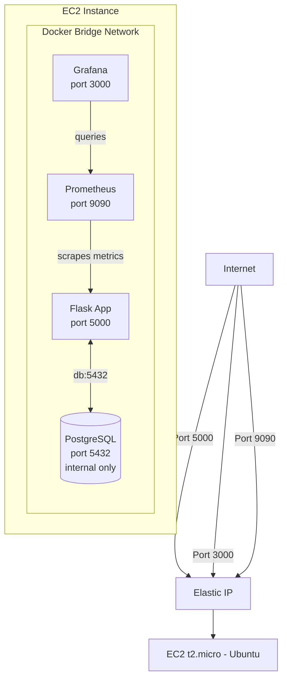

# DevOps Project

**Status:** 🟢 Active  
**Domain:** carlharvey.dev  
**Infrastructure:** AWS Free Tier (eu-west-1)  
**Last Updated:** 2026-03

---

## Overview

A containerised web application stack running on AWS EC2, demonstrating a real-world DevOps architecture with application, database, and full observability layers.

The stack consists of a Flask API, PostgreSQL database, Prometheus metrics collection, and Grafana dashboards — all managed via Docker Compose on a single EC2 instance.

---

## Architecture



---

## Infrastructure Inventory

| Resource | Type | Details | Cost |
|---|---|---|---|
| EC2 | t2.micro | Ubuntu, Docker host | Free tier |
| Elastic IP | Static IP | Attached to EC2 | Free when attached |
| Security Group | Firewall | Ports 5000, 3000, 9090 | Free |
| EBS Volume | Storage | Root volume | Free tier 30GB |

**Monthly estimate: ~£0.50** (Route 53 hosted zone only)

---

## Services

| Service | Container | Port | Public | Purpose |
|---|---|---|---|---|
| Flask App | `web` | 5000 | Yes | Python API / web service |
| PostgreSQL | `db` | 5432 | No | Persistent data store |
| Prometheus | `prometheus` | 9090 | Yes | Metrics collection |
| Grafana | `grafana` | 3000 | Yes | Metrics visualisation |

---

## Access

| Service | URL |
|---|---|
| Flask App | http://ELASTIC_IP:5000 |
| Grafana | http://ELASTIC_IP:3000 |
| Prometheus | http://ELASTIC_IP:9090 |

SSH access:
```bash
ssh -i ~/.ssh/your-key.pem ubuntu@ELASTIC_IP
```

---

## Security Notes

- PostgreSQL is **not** exposed externally — internal Docker network only
- Grafana and Prometheus are currently publicly reachable
- Consider restricting ports 3000 and 9090 to your IP only in the Security Group
- AWS Security Groups are the firewall — no ports open beyond what is listed above

---

## Monitoring

Prometheus scrapes metrics every 15 seconds.

| Target | Status | Notes |
|---|---|---|
| Prometheus itself | Active | localhost:9090 |
| Flask app | Pending | Add /metrics endpoint |
| Docker host | Pending | Add Node Exporter |

Grafana connects to Prometheus as a data source and visualises dashboards.

---

## Runbooks

- [EC2 Recovery](../../runbooks/ec2-recovery.md)
- [Deploy / Restart Stack](../../runbooks/docker-compose-deploy.md)
- [Grafana Recovery](../../runbooks/grafana-recovery.md)

---

## Next Steps

- [ ] Add /metrics endpoint to Flask for Prometheus scraping
- [ ] Add Node Exporter for host-level metrics
- [ ] Restrict Grafana and Prometheus to specific IPs in Security Group
- [ ] Set up CI/CD pipeline via GitHub Actions
- [ ] Add HTTPS via Certbot / Let's Encrypt
- [ ] Document docker-compose.yml contents here
