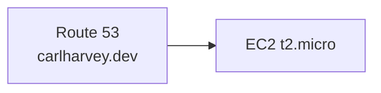

# DevOps Project

**Status:** 🟢 Active  
**Domain:** carlharvey.dev  
**Infrastructure:** AWS Free Tier

## Architecture

## Infrastructure Inventory

| Resource | Type | Region | Cost |
|---|---|---|---|
| EC2 | t2.micro | eu-west-1 | Free tier |
| Route 53 | Hosted Zone | global | ~£0.50/mo |

## Runbooks
- [EC2 Recovery](../../runbooks/ec2-recovery.md)

## Deployment
> Document your deploy process here
