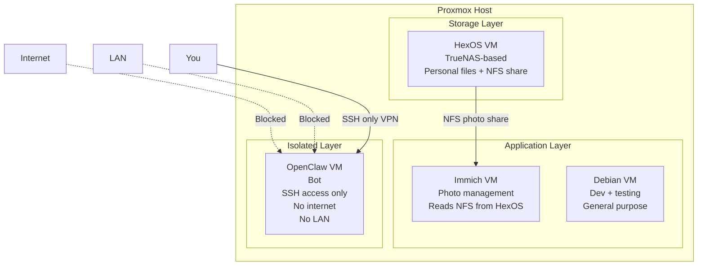

# Home Server

**Status:** 🟢 Active  
**Location:** Physical / On-Premises  
**Hypervisor:** Proxmox  
**VM Count:** 4 active (of 4 total)  
**Last Updated:** 2026-03

---

## Overview

A Proxmox-based home server running virtualised services for personal data storage, photo management, automation, and development. Services are isolated by VM — each VM has a single responsibility.

---

## Architecture

---

## VM Inventory

| VM | OS / Base | Purpose | Network | Status |
|---|---|---|---|---|
| HexOS | TrueNAS-based | Personal file storage, NFS shares | Local network | 🟢 Running |
| Immich | Linux | Google Photos clone | Local network | 🟢 Running |
| OpenClaw | Linux | OpenClaw bot | Isolated — SSH only | 🟢 Running |
| Debian | Debian | Dev and testing | Local network | 🟡 On demand |

> 44 VMs total in Proxmox — document others here as needed.

---

## Services

### HexOS
- TrueNAS-based personal data and file storage
- Serves a photo folder to Immich via NFS share
- Primary storage for personal files

### Immich
- Self-hosted Google Photos alternative
- Reads photo library from HexOS NFS share
- Web UI accessible on local network

### OpenClaw
- OpenClaw bot instance
- **Fully isolated** — no local network access, no internet access
- SSH access only — no other inbound or outbound traffic
- Isolated to prevent any unintended network exposure

### Debian
- General purpose dev and testing VM
- Spin up when needed for experimenting
- Disposable — can be snapshotted and reset

---

## Networking

| VM | Network Access | Inbound | Outbound |
|---|---|---|---|
| HexOS | Local network | NFS, Web UI | Local only |
| Immich | Local network | Web UI port | Local only |
| OpenClaw | Isolated | SSH only | None |
| Debian | Local network | SSH | Local only |

---

## Storage — HexOS

HexOS acts as the central storage layer for the home server.

| Share | Consumers | Purpose |
|---|---|---|
| Photos NFS share | Immich VM | Photo library source |
| Personal files | Direct access | Documents, backups, media |

---

## Access

| Service | How to access |
|---|---|
| Proxmox UI | https://PROXMOX_IP:8006 |
| HexOS UI | http://HEXOS_IP |
| Immich | http://IMMICH_IP:2283 |
| OpenClaw | `ssh user@OPENCLAW_IP` (SSH only) |
| Debian | `ssh user@DEBIAN_IP` |

---

## Runbooks

- [VM Snapshot & Restore](../../runbooks/vm-snapshot.md)
- [Immich Backup Restore](../../runbooks/immich-restore.md)
- [HexOS NFS Share Recovery](../../runbooks/hexos-nfs-recovery.md)

---

## Known Dependencies

- Immich depends on HexOS NFS share — if HexOS goes down, Immich loses access to the photo library
- Start order matters: **HexOS must be running before Immich**

---

## Next Steps

- [ ] Document all 44 VMs (even a one-liner per VM)
- [ ] Set up Proxmox backup jobs for HexOS and Immich
- [ ] Document HexOS NFS share configuration
- [ ] Add Tailscale or VPN for remote access
- [ ] Review OpenClaw isolation — confirm firewall rules at Proxmox level
- [ ] Snapshot Debian VM as a clean baseline
